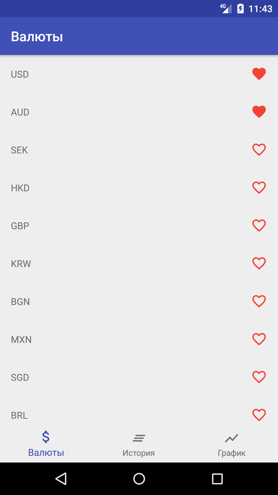
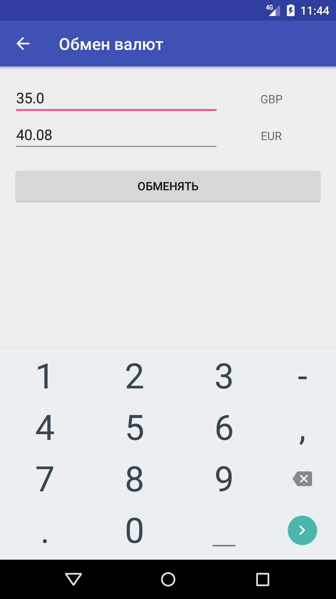
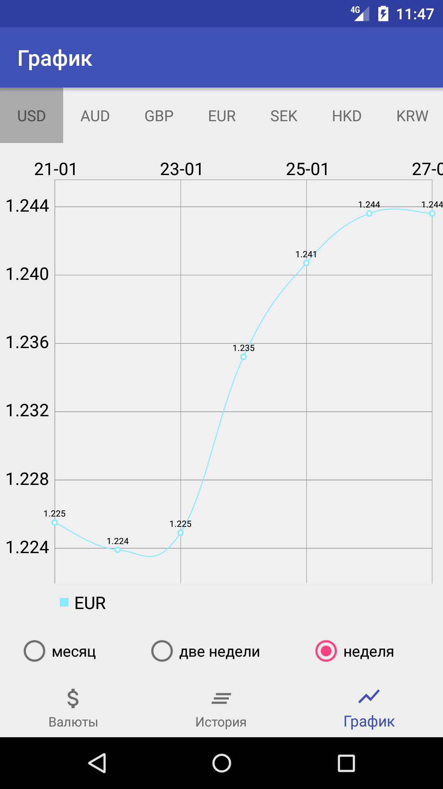
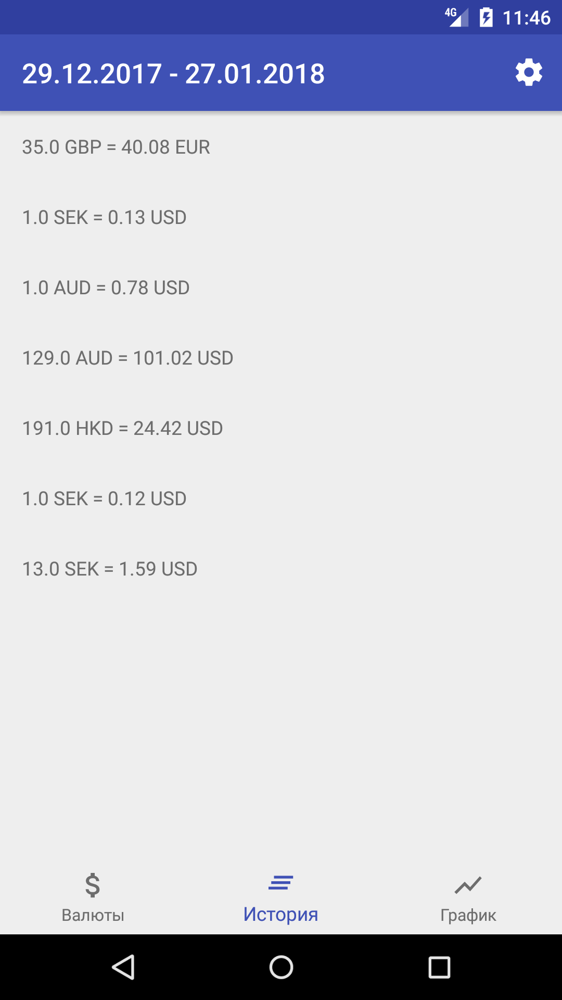
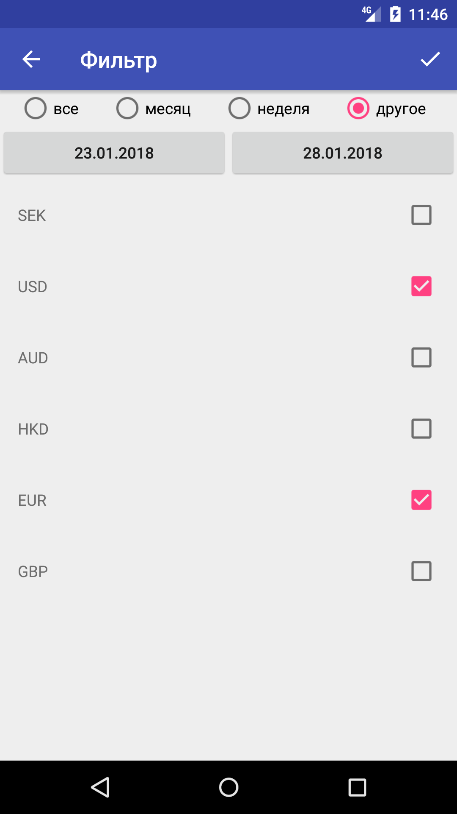

# CurrencyConverter
Simple currency converter app uses [Fixer API](http://fixer.io/)

## Features
- Choose favorite currency
- Cache of currency rate
- History of exchanges
- Filter by currency
- Filter by time
- Line chart of currency rate

## Dependencies
- [Retrofit2](https://github.com/square/retrofit)
- [ORM ROOM](https://developer.android.com/topic/libraries/architecture/room.html)
- [MPAndroidChart](https://github.com/PhilJay/MPAndroidChart)
- [JUnit](http://junit.org/junit4/)
- [Mockito](https://github.com/mockito/mockito)
- [Espresso](https://developer.android.com/training/testing/espresso/index.html)

## Screenshots

